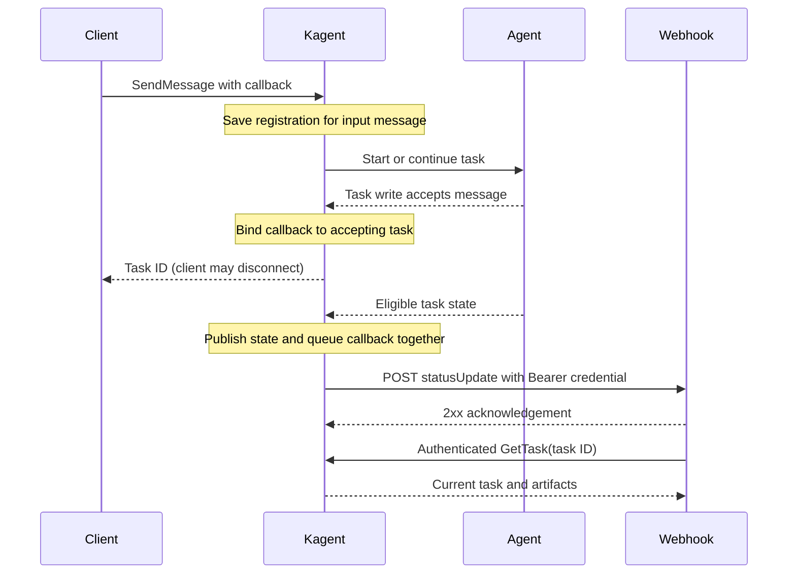
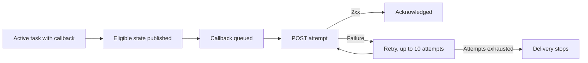
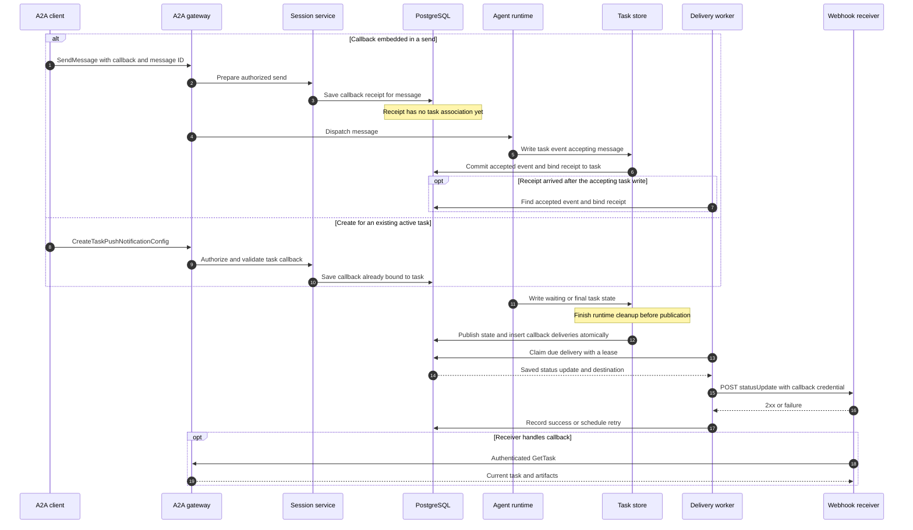

# A2A push notifications

Push notifications let a client leave a long-running task and receive a webhook
when the task needs attention or finishes. The Agent Card advertises support with
`capabilities.pushNotifications: true`. Callbacks are scoped to one task, not to
every task in its conversation.

## Set up a callback

1. Expose a webhook that accepts an HTTP POST and verifies a Bearer credential.
2. Supply a `taskPushNotificationConfig` with an HTTPS URL and that credential
   on `SendMessage` or `SendStreamingMessage`. Kagent saves the registration
   before dispatch and attaches it to a task only when that task accepts the
   message. The config's `taskId` must be empty, even when the message
   continues an existing task.
3. Alternatively, call `CreateTaskPushNotificationConfig` for an **active** task.
   Get, List, and Delete work through either public A2A transport. Create is
   rejected once the task is terminal.

For example, send this JSON-RPC body to `/agents/{namespace}/{name}` using the
deployment's normal A2A authentication:

```json
{
  "jsonrpc": "2.0",
  "id": "request-1",
  "method": "SendMessage",
  "params": {
    "message": {"messageId": "message-1", "role": "ROLE_USER", "parts": [{"text": "Hello"}]},
    "configuration": {
      "returnImmediately": true,
      "taskPushNotificationConfig": {
        "url": "https://receiver.example/callback",
        "authentication": {"scheme": "Bearer", "credentials": "receiver-secret"}
      }
    }
  }
}
```

The CLI offers the same initial-send flow with
`kagent agent invoke --session SESSION_ID --task TEXT --push-url URL --push-bearer-token-file PATH`.
For an existing active task, use
`kagent agent session push create SESSION_ID TASK_ID --url URL --bearer-token-file PATH`;
`push get`, `push list`, and `push delete` manage its callbacks.

## What happens

For a callback embedded in `SendMessage`, Kagent first stores a registration
identified by the input message. It does not attach that registration to a task
just because the message names one: the task write must record that it accepted
the input. That write binds the callback to the task in the same database
transaction. A failed or unaccepted send therefore leaves no callback active on
an existing task. If a registration arrives after its message was accepted, a
maintenance worker can recover the association from the accepted message event.
Explicit task-level Create already identifies the task and does not use this
message-binding step.

Binding does not send a webhook. When a later eligible task state is published,
Kagent queues its status update for callbacks bound to that task.



Kagent sends a JSON A2A `statusUpdate` for `INPUT_REQUIRED`, `AUTH_REQUIRED`, or
a terminal state (`COMPLETED`, `FAILED`, `CANCELED`, or `REJECTED`). The update
contains the task ID and status; it may contain a status message. Treat it as a
signal to call authenticated `GetTask` for the current result and artifacts.
Ordinary progress updates do not trigger callbacks.



## Guarantees and client responsibilities

- An embedded callback receives only eligible states published **after its
  message is accepted and the callback is bound to the task**. Explicit Create
  subscribes when the config is saved. Neither path replays earlier states.
  New tasks in the same conversation need their own callback; forks do not
  inherit callbacks.
- Delivery is best effort. Failed requests retry up to ten times, including
  across controller restarts. A callback can arrive more than once or out of
  order. Use `GetTask` as the source of truth and make webhook handling idempotent.
- Any 2xx response acknowledges delivery. Keep the receiver available, validate
  the callback, and respond promptly. Kagent does not expose delivery status.
- An embedded callback without an ID gets a stable ID for retries of the same
  message. Task-level Create without an ID generates a new ID each time; supply
  your own ID if you may retry Create. Multiple IDs can subscribe to one task.
- Creating a config with an existing ID replaces its URL or credentials. Delete
  removes an active callback. Queued deliveries for an old or deleted config are
  canceled, but a request already in flight may still arrive.

## Security

The webhook must verify `Authorization: Bearer <credentials>`. An optional
`token` is also sent in `A2A-Notification-Token` for additional validation.
Create, Get, and List responses omit both secrets; keep them securely on the
client and supply new values when replacing a config. Task reads still require
normal A2A authorization.

Callback URLs require HTTPS. The controller blocks private, loopback, and
link-local destinations by default. Operators can allow trusted internal
receivers with `KAGENT_A2A_PUSH_ALLOW_PRIVATE_NETWORKS=true` and allow HTTP for
local development with the separate `KAGENT_A2A_PUSH_ALLOW_HTTP=true` setting.

## Appendix: how the components work together

The A2A gateway handles the public send and callback-management methods. The
session service authorizes the request, checks the callback configuration, and
resolves the conversation or task. PostgreSQL keeps registrations, accepted
task events, and pending deliveries. The agent runtime writes task events
through the task store; after runtime cleanup, the task store publishes an
eligible state and queues its callbacks in one database transaction. A
leader-elected delivery worker sends those queued callbacks to the receiver.



The accepted message event is the link between an embedded callback and its
task. A send can name an existing task without being accepted by it, so saving
the receipt alone does not activate the callback. The task write normally binds
them together. If the receipt arrives after that write, the worker can find the
accepted event and bind it later. An unresolved receipt eventually expires;
binding itself never sends or replays a callback.

The receipt keeps a fingerprint of the original send. Retrying the same message
with the same callback is safe, while retrying it with different callback data
is rejected; a retry also cannot undo a later edit or deletion. For an explicit
Create, the task and callback ID identify the configuration to add or replace.

Each published eligible state creates one durable delivery per active callback.
The delivery contains the status update and a snapshot of the destination, so
HTTP runs outside the task transaction. A failed attempt remains queued for
retry with exponential backoff. The worker leases a delivery before sending;
an expired lease allows recovery after a crash, while a claim token prevents an
older worker from recording an outcome over a newer attempt. Replacing or
deleting a callback cancels its queued deliveries. A request already in flight
can still arrive, which is why receivers should treat the callback as a prompt
to call `GetTask` rather than as the authoritative task state.
